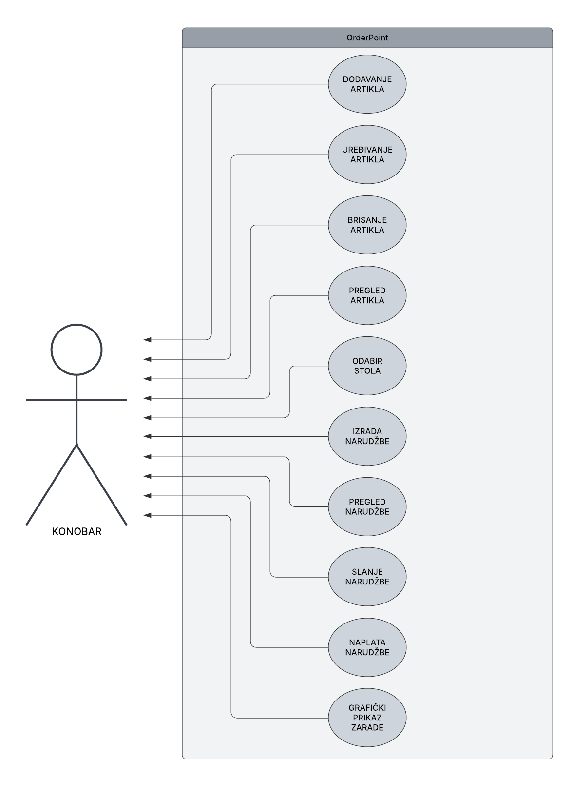

# OrderPoint

## **Upravljanje narudžbama u ugostiteljstvu**

Projekt izrađen u sklopu kolegija **Informacijski sustavi** na FIPU.

Projekt je osmišljen za potrebe ugostiteljskih objekata, omogućujući jednostavno zaprimanje, praćenje i naplatu narudžbi te pregled zarade.

---

## Opis

**OrderPoint** je web aplikacija za upravljanje narudžbama u kafiću ili restoranu. Aplikacija omogućuje:

- dodavanje artikala (npr. pića i hrane),
- kreiranje narudžbi po stolovima,
- naplatu i evidenciju svake narudžbe,
- grafički prikaz zarade po danima.

Frontend aplikacije je izrađen pomoću HTML-a, CSS-a i Bootstrapa, dok je backend napravljen u Pythonu s Flask okvirom. Za rad s bazom koristi se **PonyORM** i **SQLite**.

---

## UseCase dijagram



---

## Kako pokrenuti aplikaciju

### 🐳 Pomoću Docker-a

1. **Instalirajte Docker** – osigurajte da imate instaliran Docker na svom računalu.

2. **Klonirajte repozitorij**:

```bash
git clone https://github.com/tedistucin97/Projekt_OrderPoint.git
cd Projekt_OrderPoint/backend
```

3. **Pokrenite aplikaciju**:

```bash
sudo docker-compose up --build
```

4. **Otvorite preglednik:**

Aplikacija će biti dostupna na:  
[http://localhost:5000](http://localhost:5000)

---

## Tehnologije

- **Backend**: Python, Flask, PonyORM, SQLite
- **Frontend**: HTML, CSS, Bootstrap
- **Grafički prikaz**: Chart.js
- **Docker**: Dockerfile + docker-compose.yml

---

## Autor

**Tedi Štucin**, 0303120415, FIPU 2024/2025

---

## Licenca

Ovaj projekt je otvorenog koda. Licenciranje se može definirati prema potrebama.
